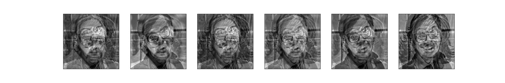
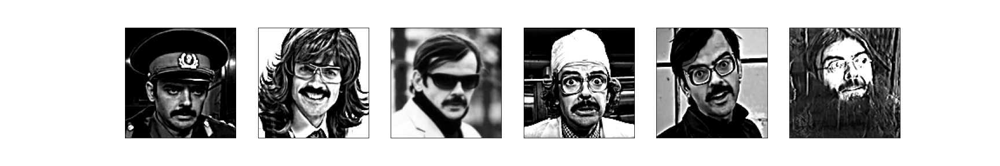

<h1 align="center">CAMNS Method</h1>

The original paper can be found [here](https://www.researchgate.net/profile/Chong-Yung-Chi/publication/251134144_A_Convex_Analysis_Framework_for_Blind_Separation_of_NonNegative_Sources/links/5a1e7622aca272cbfbc04995/A-Convex-Analysis-Framework-for-Blind-Separation-of-NonNegative-Sources.pdf)

## Implementation

- The method is implemented inside [src/camns.py](./src/camns.py) file;
- Also you can see the [demo](./src/demo.ipynb).
